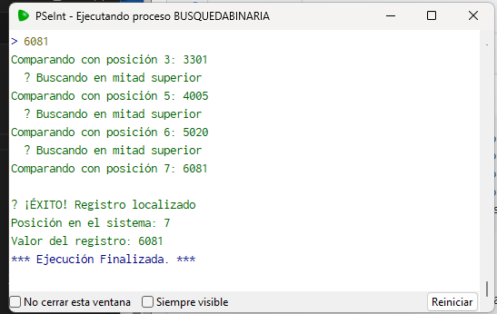

 Preguntas de Reflexión
1.¿Cuántas comparaciones se hacen al buscar 6081 en ambos algoritmos?

Binaria: 4 comparaciones (3 → 5 → 6 → 7)
     
    R: 4 comparaciones

Lineal: 8 comparaciones (recorrer todo)
R: 8 comparaciones.

¿Qué sucedería si el arreglo tuviera 1 millón de registros?

Binaria: log₂(1,000,000) ≈ 20 comparaciones

R: Con búsqueda binaria el arreglo se partiria a la mitad en 20 veces, lo cual tendria como resultado 20 comparaciones en total.

Lineal: Hasta 1,000,000 comparaciones ⚠️

R: Compara uno por uno, siendo un proceso más demorado, llegando hasta 1,000,000.

¿Es obligatorio que el arreglo esté ordenado? ¿Por qué?

SÍ. La búsqueda binaria divide por la mitad asumiendo valores menores a la izquierda y mayores a la derecha.